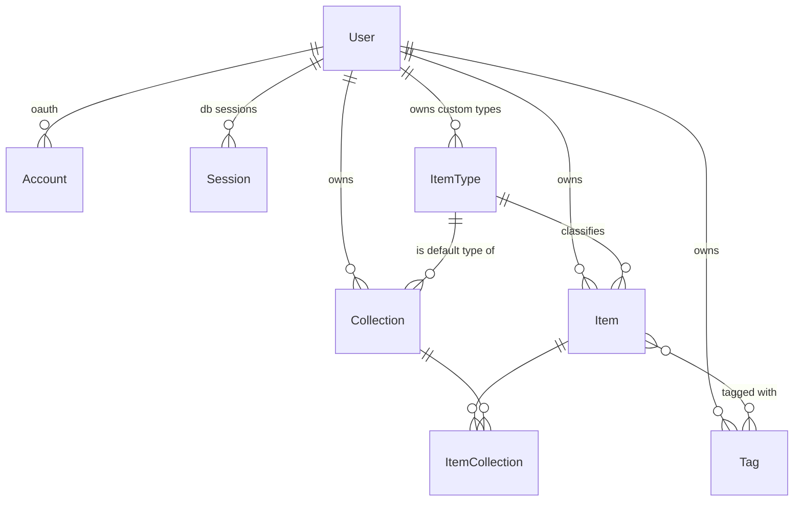
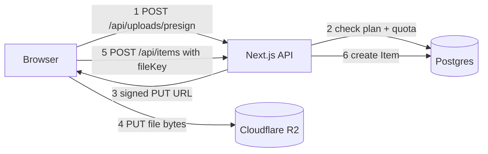

# DevStash — Product & Technical Spec

> **One line:** One fast, searchable, AI-enhanced hub for everything a developer stashes — snippets, prompts, commands, notes, links and files.

**Status:** Draft v0.2 · **Stack:** Next.js 16 · React 19 · TypeScript · Neon Postgres · Prisma 7 · NextAuth v5 · Tailwind v4 + shadcn/ui · Cloudflare R2 · OpenAI

---

## 1. Problem

Developer knowledge is scattered across tools that were never meant to hold it:

| What | Where it ends up today |
| --- | --- |
| Code snippets | VS Code scratch files, Notion |
| AI prompts | Buried in chat history |
| Context files | Random project folders |
| Useful links | Browser bookmarks |
| Commands | `.txt` files, `~/.bash_history` |
| Boilerplates | GitHub gists |

The cost is context switching, lost knowledge, and inconsistent workflows across projects. DevStash consolidates all of it into one place with fast capture, fast retrieval, and AI on top.

## 2. Target users

| Persona | Primary need | Types they lean on |
| --- | --- | --- |
| **Everyday developer** | Grab a snippet or command in seconds | snippet, command, link |
| **AI-first developer** | Store prompts, contexts, system messages | prompt, file, note |
| **Content creator / educator** | Reusable code blocks and explanations | snippet, note |
| **Full-stack builder** | Patterns, boilerplates, API examples | snippet, file, link |

All four share the same core loop: **capture fast → find fast → paste**. Optimising that loop is the product. Everything else is secondary.

---

## 3. Feature set

### 3.1 Items & item types

Every item has exactly one **type**. Types are seeded as system types (immutable); custom user types come later (Pro).

Each type has a **content shape** that determines which fields are used and how the editor renders:

| Type | Content shape | Icon ([lucide](https://lucide.dev/icons/)) | Color | Tier |
| --- | --- | --- | --- | --- |
| Snippet | `TEXT` | [`Code`](https://lucide.dev/icons/code) | `#3b82f6` blue | Free |
| Prompt | `TEXT` | [`Sparkles`](https://lucide.dev/icons/sparkles) | `#8b5cf6` purple | Free |
| Command | `TEXT` | [`Terminal`](https://lucide.dev/icons/terminal) | `#f97316` orange | Free |
| Note | `TEXT` | [`StickyNote`](https://lucide.dev/icons/sticky-note) | `#fde047` yellow | Free |
| Link | `URL` | [`Link`](https://lucide.dev/icons/link) | `#10b981` emerald | Free |
| File | `FILE` | [`File`](https://lucide.dev/icons/file) | `#6b7280` gray | **Pro** |
| Image | `FILE` | [`Image`](https://lucide.dev/icons/image) | `#ec4899` pink | **Pro** |

> ⚠️ **Contrast check:** `#fde047` (note yellow) fails WCAG AA as a border or text color on a dark background at small sizes, and is invisible on light. Use it as a fill/accent only, or darken to `#eab308` for strokes.

Items are created and opened in a **drawer**, never a full page navigation. That is the single most important interaction in the app.

### 3.2 Collections

- A collection holds items of **any** type.
- An item can belong to **many** collections (`React Patterns` *and* `Interview Prep`).
- Collections have an optional `defaultType`, used to color the card and preselect the type when a collection is still empty.
- Card background color = the type the collection holds most of, falling back to `defaultType`, falling back to neutral.

### 3.3 Search

Single search surface across **title, content, description, tags and type**. See [§6.4](#64-search-implementation) — this needs Postgres full-text search, not `contains`.

### 3.4 Auth

Email/password **or** GitHub OAuth, via NextAuth v5.

### 3.5 Quality-of-life

- Favorite items and collections
- Pin items to top
- Recently used (requires a `lastUsedAt` field — see [§5](#5-data-model))
- Import code from a local file
- Markdown editor + syntax highlighting for text types
- File upload for `FILE` types
- Export data (Pro)
- Dark mode by default, light mode optional
- Add/remove an item to/from multiple collections; see an item's collection memberships from the drawer

### 3.6 AI features (Pro)

| Feature | Input | Output |
| --- | --- | --- |
| Auto-tag suggestions | title + content + type | 3–5 suggested tags, user accepts/rejects |
| Summaries | content | 1–2 sentence description written into `description` |
| Explain this code | content + language | Markdown explanation, rendered in drawer |
| Prompt optimizer | prompt content | Rewritten prompt + short diff rationale |

All four are stateless single-shot calls to `gpt-5-nano`. Rate-limit per user; never call on every keystroke.

---

## 4. Entity relationship diagram



**Key decisions encoded above**

1. `contentType` lives on **ItemType**, not on Item. The type already determines whether an item is text, a URL or a file — duplicating it on Item creates two sources of truth that will drift. This also means custom types (Pro) get a content shape for free.
2. `Tag` is **scoped to a user** (`@@unique([userId, name])`). A global tag table would leak one user's tag vocabulary into another's autocomplete.
3. `ItemCollection` is an **explicit** join table because it carries `addedAt`. `Item ↔ Tag` uses Prisma's **implicit** many-to-many, since it carries no extra data and the implicit form gives much nicer nested writes.
4. System `ItemType` rows have `userId = null`.

---

## 5. Data model

### 5.1 `prisma/schema.prisma`

```prisma
generator client {
  provider = "prisma-client"
  output   = "../src/generated/prisma"
}

datasource db {
  provider = "postgresql"
}

// ───────────────────────── Auth (NextAuth v5 / @auth/prisma-adapter)

model User {
  id            String    @id @default(cuid())
  name          String?
  email         String    @unique
  emailVerified DateTime?
  image         String?
  passwordHash  String? // null for OAuth-only users

  // Billing
  plan                   Plan      @default(FREE)
  stripeCustomerId       String?   @unique
  stripeSubscriptionId   String?   @unique
  stripePriceId          String?
  stripeCurrentPeriodEnd DateTime?

  createdAt DateTime @default(now())
  updatedAt DateTime @updatedAt

  accounts    Account[]
  sessions    Session[]
  items       Item[]
  itemTypes   ItemType[]
  collections Collection[]
  tags        Tag[]
}

enum Plan {
  FREE
  PRO
}

model Account {
  userId            String
  type              String
  provider          String
  providerAccountId String
  refresh_token     String?
  access_token      String?
  expires_at        Int?
  token_type        String?
  scope             String?
  id_token          String?
  session_state     String?

  user User @relation(fields: [userId], references: [id], onDelete: Cascade)

  @@id([provider, providerAccountId])
  @@index([userId])
}

model Session {
  sessionToken String   @unique
  userId       String
  expires      DateTime

  user User @relation(fields: [userId], references: [id], onDelete: Cascade)

  @@index([userId])
}

model VerificationToken {
  identifier String
  token      String
  expires    DateTime

  @@id([identifier, token])
}

// ───────────────────────── Core

enum ContentType {
  TEXT
  URL
  FILE
}

model ItemType {
  id          String      @id @default(cuid())
  name        String // "Snippet"
  slug        String // "snippets" → /items/snippets
  contentType ContentType
  icon        String // lucide icon name, e.g. "Code"
  color       String // hex, e.g. "#3b82f6"
  isSystem    Boolean     @default(false)
  isProOnly   Boolean     @default(false)
  sortOrder   Int         @default(0)

  userId String? // null for system types
  user   User?   @relation(fields: [userId], references: [id], onDelete: Cascade)

  items      Item[]
  defaultFor Collection[]

  @@unique([userId, slug])
  @@index([userId])
}

model Item {
  id          String  @id @default(cuid())
  title       String
  description String?

  // Exactly one shape is populated, driven by itemType.contentType
  content  String? // TEXT
  language String? // TEXT — syntax highlight hint ("tsx", "bash", …)
  url      String? // URL
  fileKey  String? // FILE — R2 object key, NOT a public URL
  fileName String?
  fileSize Int?
  mimeType String?

  isFavorite Boolean @default(false)
  isPinned   Boolean @default(false)

  lastUsedAt DateTime? // powers "Recently used"
  useCount   Int       @default(0)

  createdAt DateTime @default(now())
  updatedAt DateTime @updatedAt

  userId     String
  user       User     @relation(fields: [userId], references: [id], onDelete: Cascade)
  itemTypeId String
  itemType   ItemType @relation(fields: [itemTypeId], references: [id], onDelete: Restrict)

  tags        Tag[]
  collections ItemCollection[]

  // Added by hand-written migration — see §6.4
  searchVector Unsupported("tsvector")?

  @@index([userId, updatedAt(sort: Desc)])
  @@index([userId, itemTypeId])
  @@index([userId, isPinned])
  @@index([userId, isFavorite])
  @@index([userId, lastUsedAt(sort: Desc)])
}

model Collection {
  id          String  @id @default(cuid())
  name        String
  description String?
  isFavorite  Boolean @default(false)

  defaultTypeId String?
  defaultType   ItemType? @relation(fields: [defaultTypeId], references: [id], onDelete: SetNull)

  createdAt DateTime @default(now())
  updatedAt DateTime @updatedAt

  userId String
  user   User   @relation(fields: [userId], references: [id], onDelete: Cascade)

  items ItemCollection[]

  @@unique([userId, name])
  @@index([userId, updatedAt(sort: Desc)])
}

model ItemCollection {
  itemId       String
  collectionId String
  addedAt      DateTime @default(now())

  item       Item       @relation(fields: [itemId], references: [id], onDelete: Cascade)
  collection Collection @relation(fields: [collectionId], references: [id], onDelete: Cascade)

  @@id([itemId, collectionId])
  @@index([collectionId, addedAt(sort: Desc)])
}

model Tag {
  id        String   @id @default(cuid())
  name      String
  createdAt DateTime @default(now())

  userId String
  user   User   @relation(fields: [userId], references: [id], onDelete: Cascade)

  items Item[]

  @@unique([userId, name])
  @@index([userId])
}
```

### 5.2 Changes from your original notes

| Change | Why |
| --- | --- |
| `contentType` moved from Item → ItemType | Single source of truth; custom types inherit a shape |
| Added `URL` to the content enum | Your notes had `text \| file` but described three shapes |
| `fileUrl` → `fileKey` (+ `mimeType`) | R2 buckets should stay private; generate signed URLs on read |
| `isPro` boolean → `plan` enum | Room for future tiers without a schema change |
| Added `stripePriceId`, `stripeCurrentPeriodEnd` | Needed to render billing state and handle grace periods |
| Added `lastUsedAt` / `useCount` on Item | "Recently used" was a listed feature with no field behind it |
| Added `userId` to Tag + `@@unique([userId, name])` | Tags were global and would collide across accounts |
| Added `slug` to ItemType | Drives `/items/snippets` without string-munging `name` |
| Added `isProOnly` to ItemType | Encodes the file/image gate in data, not in `if` statements |
| Added compound indexes on `userId` | Every query is user-scoped; without these it's a seq scan |
| Added explicit `onDelete` everywhere | Otherwise deleting a user fails on FK constraints |

### 5.3 The system-type uniqueness gotcha

`@@unique([userId, slug])` does **not** prevent two system types sharing a slug, because Postgres treats every `NULL` as distinct. Add a partial unique index in a hand-written migration:

```sql
CREATE UNIQUE INDEX "ItemType_system_slug_key"
  ON "ItemType" ("slug")
  WHERE "userId" IS NULL;
```

---

## 6. Implementation notes

### 6.1 Prisma 7 setup (this changed a lot — don't follow v6 tutorials)

Prisma 7 dropped the Rust query engine and made three things mandatory:

The `output` field is now **required** in the generator block (the client is no longer generated into `node_modules`), the `prisma-client` provider replaces `prisma-client-js`, and creating a client now requires a driver adapter for all databases.

```ts
// prisma.config.ts — at project root, next to package.json
import "dotenv/config";
import { defineConfig, env } from "prisma/config";

export default defineConfig({
  schema: "prisma/schema.prisma",
  migrations: {
    path: "prisma/migrations",
    seed: "tsx prisma/seed.ts",
  },
  datasource: {
    url: env("DATABASE_URL"), // direct (non-pooled) Neon URL for migrations
    shadowDatabaseUrl: env("SHADOW_DATABASE_URL"),
  },
});
```

```ts
// src/lib/db.ts
import { PrismaClient } from "@/generated/prisma/client";
import { PrismaPg } from "@prisma/adapter-pg";

const adapter = new PrismaPg({ connectionString: process.env.DATABASE_URL });

const globalForPrisma = globalThis as unknown as { prisma?: PrismaClient };

export const prisma = globalForPrisma.prisma ?? new PrismaClient({ adapter });
if (process.env.NODE_ENV !== "production") globalForPrisma.prisma = prisma;
```

Other v7 gotchas worth knowing up front:

- Environment variables are no longer loaded automatically — you need `dotenv` (or Bun) to load them for CLI commands.
- `migrate dev` and `db push` no longer run `prisma generate` automatically; run it explicitly.
- Seeding no longer runs automatically after `migrate dev` / `migrate reset` — run `prisma db seed` yourself.
- Client middleware (`$use`) is removed; use client extensions instead.
- Connection pooling now comes from the `pg` driver, not Prisma. On Neon + serverless, use the **pooled** connection string at runtime and the **direct** one for migrations. Consider `@prisma/adapter-neon` over `@prisma/adapter-pg` if you deploy to the edge.

> 🔴 **Heads up:** your notes say "Prisma 7 latest." Prisma's docs now list **Prisma ORM 8 as the current release**, and 7.10 shipped a `@prisma/prisma7` compatibility package so 7 and 8 can coexist during migration. Decide deliberately: pinning 7 is defensible for stability, but you should know you're not on latest. Verify against the live docs before you commit.

### 6.2 Migrations discipline

Per your note — **never** `prisma db push`, in any environment.

```bash
npx prisma migrate dev --name add_item_search_vector   # dev: create + apply
npx prisma generate                                    # explicit in v7
npx prisma migrate deploy                              # prod / CI
```

For raw SQL (partial indexes, tsvector), generate an empty migration and edit it:

```bash
npx prisma migrate dev --create-only --name add_search_vector
```

### 6.3 Seeding system types

`prisma/seed.ts` upserts the seven system types by `slug`. It must be **idempotent** — it runs on every fresh environment.

```ts
const SYSTEM_TYPES = [
  { slug: "snippets", name: "Snippet", contentType: "TEXT", icon: "Code",       color: "#3b82f6", sortOrder: 0 },
  { slug: "prompts",  name: "Prompt",  contentType: "TEXT", icon: "Sparkles",   color: "#8b5cf6", sortOrder: 1 },
  { slug: "commands", name: "Command", contentType: "TEXT", icon: "Terminal",   color: "#f97316", sortOrder: 2 },
  { slug: "notes",    name: "Note",    contentType: "TEXT", icon: "StickyNote", color: "#fde047", sortOrder: 3 },
  { slug: "links",    name: "Link",    contentType: "URL",  icon: "Link",       color: "#10b981", sortOrder: 4 },
  { slug: "files",    name: "File",    contentType: "FILE", icon: "File",       color: "#6b7280", sortOrder: 5, isProOnly: true },
  { slug: "images",   name: "Image",   contentType: "FILE", icon: "Image",      color: "#ec4899", sortOrder: 6, isProOnly: true },
] as const;
```

### 6.4 Search implementation

`contains` + `mode: "insensitive"` will not survive a few thousand items and can't rank results. Use Postgres full-text search with a generated column:

```sql
-- migration
ALTER TABLE "Item" ADD COLUMN "searchVector" tsvector
  GENERATED ALWAYS AS (
    setweight(to_tsvector('english', coalesce("title", '')), 'A') ||
    setweight(to_tsvector('english', coalesce("description", '')), 'B') ||
    setweight(to_tsvector('english', coalesce("content", '')), 'C')
  ) STORED;

CREATE INDEX "Item_search_idx" ON "Item" USING GIN ("searchVector");

-- optional: fuzzy title matching for typos
CREATE EXTENSION IF NOT EXISTS pg_trgm;
CREATE INDEX "Item_title_trgm_idx" ON "Item" USING GIN ("title" gin_trgm_ops);
```

The `searchVector Unsupported("tsvector")?` field in the schema exists purely so Prisma doesn't drop the column on the next migration. Query it with `$queryRaw`, filtered by `userId` first. Tags and type are normal `where` clauses layered on top.

### 6.5 File uploads (R2)

Never proxy file bytes through a Next.js route handler — you'll hit body size limits and burn function time.



On read, `/api/files/[itemId]` verifies ownership, then 302s to a short-lived signed GET URL. Keep the bucket private.

### 6.6 Collection card colors

"Color the card by the type it holds most of" is a `GROUP BY` per collection. Don't run it per card — that's N+1 on the main grid. Either:

- **(a)** one `groupBy` query across `ItemCollection ⋈ Item` for all of a user's collections, joined in memory, or
- **(b)** denormalise `dominantTypeId` onto Collection, recomputed when items are added/removed.

Start with (a). Move to (b) only if the dashboard query shows up slow.

### 6.7 Redis

Skip it for MVP. Neon + Next.js caching is enough at this scale. The one place it earns its keep is **rate limiting the AI endpoints** — add Upstash Redis when you ship §3.6, not before.

---

## 7. Routes

### 7.1 Pages

| Route | Purpose |
| --- | --- |
| `/` | Marketing landing (logged out) |
| `/dashboard` | Collections grid + recent items |
| `/items` | All items |
| `/items/[typeSlug]` | Type-filtered list — `/items/snippets` |
| `/collections` | All collections |
| `/collections/[id]` | Single collection |
| `/search?q=` | Search results |
| `/settings` · `/settings/billing` | Account + Stripe portal |
| `/login` · `/register` | Auth |

**Drawer routing:** open an item with `?item=<id>` appended to the current route rather than a nested page. It keeps the underlying list mounted, makes item URLs shareable and back-button-correct, and avoids the complexity of parallel + intercepting routes. Prefetch item data on card hover.

### 7.2 API

```
POST   /api/items                        create
GET    /api/items?type=&collection=&q=   list
PATCH  /api/items/[id]                   update
DELETE /api/items/[id]
POST   /api/items/[id]/use               bump lastUsedAt + useCount (fire-and-forget on copy)

POST   /api/collections
PATCH  /api/collections/[id]
DELETE /api/collections/[id]
POST   /api/collections/[id]/items       { itemId }  → add
DELETE /api/collections/[id]/items/[itemId]          → remove

POST   /api/uploads/presign              → { url, key }
GET    /api/files/[itemId]               → 302 signed URL

POST   /api/ai/tags | summarize | explain | optimize-prompt

POST   /api/stripe/checkout | portal
POST   /api/webhooks/stripe
GET    /api/export?format=json|zip
```

---

## 8. Monetization

| | Free | Pro — **$8/mo** or **$72/yr** |
| --- | --- | --- |
| Items | 50 | Unlimited |
| Collections | 3 | Unlimited |
| Types | All except File/Image | All + custom types *(later)* |
| Search | Basic | Basic *(see note)* |
| File & image upload | ✗ | ✓ |
| AI auto-tagging | ✗ | ✓ |
| AI summaries / explain / prompt optimizer | ✗ | ✓ |
| Export (JSON/ZIP) | ✗ | ✓ |
| Support | Community | Priority |

> 💡 "Basic search" vs. what? Right now the free/paid search split is undefined — you've listed *Basic search* on Free and nothing on Pro. Either drop search from the table entirely (it's table stakes) or define the Pro upgrade concretely, e.g. free = title + tags only, Pro = full content search. I'd make search unlimited on both and let AI be the wedge.

**Enforcement:** gate at the API layer, not the UI. A single `assertWithinQuota(userId, "items")` helper that counts and throws is enough. Per your note, during development every user gets everything — put that behind one env flag (`BILLING_ENFORCED=false`) rather than scattered `if`s, so flipping it on is a one-line change.

**Annual price check:** $72/yr against $8/mo is a 25% discount, which is standard. Just confirm you want the annual price to read as "$6/mo billed annually" in the UI — that framing converts better than "$72".

---

## 9. UI/UX

### 9.1 Principles

Modern, minimal, developer-focused. Dark by default, light optional. Clean typography, generous whitespace, subtle borders and shadows. References: **Linear** (density + keyboard), **Raycast** (command palette + speed), **Notion** (editor feel).

### Screenshot

Refer to the screenshots below as a base for the dashboard UI. It does not have to be exact. Use it as a reference.

- [Dashboard — main](screenshots/dashboard-ui-main.png)
- [Dashboard — item drawer](screenshots/dashboard-ui-drawer.png)

### 9.2 Layout

```
┌──────────────┬──────────────────────────────────────┬────────────────┐
│  SIDEBAR     │  MAIN                                │  ITEM DRAWER   │
│  (collapse)  │                                      │  (?item=xyz)   │
│              │  ┌──────┐ ┌──────┐ ┌──────┐          │                │
│  ▸ All items │  │ Coll │ │ Coll │ │ Coll │  ← bg    │  Title         │
│              │  │ card │ │ card │ │ card │    color │  ─────────     │
│  TYPES       │  └──────┘ └──────┘ └──────┘          │  [code block]  │
│  ◻ Snippets  │                                      │                │
│  ◻ Prompts   │  ┌──────┐ ┌──────┐ ┌──────┐  ← left  │  Tags · Colls  │
│  ◻ Commands  │  │ Item │ │ Item │ │ Item │    border│  Copy · Edit   │
│  ◻ Notes     │  └──────┘ └──────┘ └──────┘    color │                │
│  ◻ Links     │                                      │                │
│              │                                      │                │
│  COLLECTIONS │                                      │                │
│  ◻ Recent 1  │                                      │                │
│  ◻ Recent 2  │                                      │                │
└──────────────┴──────────────────────────────────────┴────────────────┘
```

- **Collection cards:** background tinted by dominant type (low opacity — ~10–15%, never full saturation).
- **Item cards:** left border in the type color, type icon in the corner.
- **Mobile:** sidebar becomes a slide-in drawer; item drawer becomes a bottom sheet.

### 9.3 Keyboard & micro-interactions

This is a developer tool — keyboard is not a nice-to-have.

| Shortcut | Action |
| --- | --- |
| `⌘K` | Command palette / search |
| `⌘N` | New item drawer |
| `⌘C` on focused card | Copy content + bump `lastUsedAt` |
| `Esc` | Close drawer |
| `⌘\` | Toggle sidebar |

Plus: smooth transitions, card hover states, toast on every mutation, loading skeletons (never spinners on lists).

---

## 10. Suggested build order

| # | Milestone | Contents |
| --- | --- | --- |
| 0 | **Foundation** | Next.js 16 + TS + Tailwind v4 + shadcn, Prisma 7 + `prisma.config.ts`, Neon, first migration, seed script |
| 1 | **Auth** | NextAuth v5, GitHub OAuth + credentials, protected layout |
| 2 | **Items CRUD** | Drawer create/edit/delete, markdown editor, syntax highlighting, type filtering |
| 3 | **Collections** | CRUD, add/remove items, membership view, dashboard grid |
| 4 | **Search & polish** | tsvector migration, `⌘K` palette, favorites, pins, recently used |
| 5 | **Files** | R2 presign flow, file + image types, import from file |
| 6 | **Billing** | Stripe checkout + portal + webhooks, quota enforcement, flip `BILLING_ENFORCED` |
| 7 | **AI** | Four `gpt-5-nano` endpoints + Upstash rate limiting |
| 8 | **Export & extras** | JSON/ZIP export, custom types |

Ship 0–4 as the free product before touching Stripe. Steps 2 and 4 are where the product actually lives; don't rush them to get to AI.

---

## 11. Open decisions

1. **NextAuth credentials + database sessions don't mix.** The Credentials provider requires the **JWT** session strategy in NextAuth v5, which means the `Session` table goes unused. Keep the model for adapter compatibility, but know that `strategy: "jwt"` is forced by your email/password requirement — and that `isPro` in the JWT will be stale until refresh. Either re-read `plan` from the DB in your quota check (recommended) or force a token refresh on the Stripe webhook.
2. **Prisma 7 vs 8.** See §6.1. Pick one and pin it.
3. **Deletion = hard or soft?** No trash/undo in the current spec. A `deletedAt` column is cheap to add now and painful to retrofit. Worth 20 minutes of thought.
4. **Search tiering.** See §8.
5. **`name` vs `slug` uniqueness for collections.** `@@unique([userId, name])` blocks duplicate collection names — is that the behaviour you want, or should duplicates be allowed?
6. **Item versioning.** Snippets get edited. Does anyone ever want the previous version back? If yes, it changes the Item model — decide before launch, not after.
7. **Browser extension / CLI.** Not in scope, but capture-from-anywhere is the feature that would make this sticky. Worth keeping the API shape friendly to it.